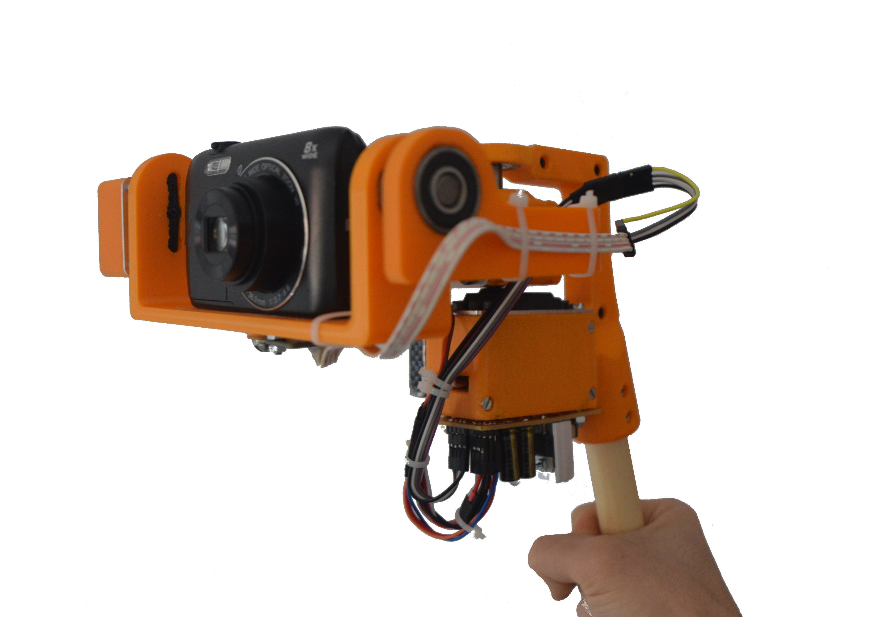

# Arduino_Gimbal_Digital_Camera

UPM-Polytechnic University of Madrid, ETSIDI 

Author: Andrés Fernández Muñoz (55237)  
Degree: Automatic and Industrial Electronics Engineering  
Academic year: 2021/2022  
Subject: Control Engineering   

Original name: Estabilizador casero para cámara de fotos (Gimbal)

Otto Robot

 

Thingiverse: 
https://www.thingiverse.com/thing:5198473 

Code: 
https://github.com/Fernandezaginer/Arduino_Gimbal_Digital_Camera 

Video: 
https://youtu.be/I12GMhbFFeI 
